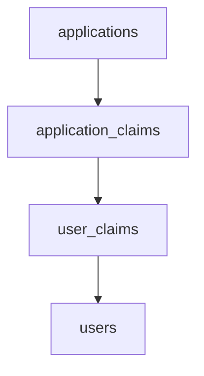

# Overview
The following shows the data model for the applications, claims, and users tables in the database.

# Diagram

# Tables
## Applications
Contains the list of applications supported by the American Board of Surgery
## Application_Claims
Contains the relationship between Applications and available Claims for the application.  The relationship is one-to-many. Applications.ApplicationId => Application_Claims.ApplicationId.
## User_Claims
Contains the relationship between the defined Claims for an Application and Users.
## Users
Contains the list of Users for all Applications. The intersection link is between the Application Claims and the User Claims table. Users are not directly related to a single Application. 
